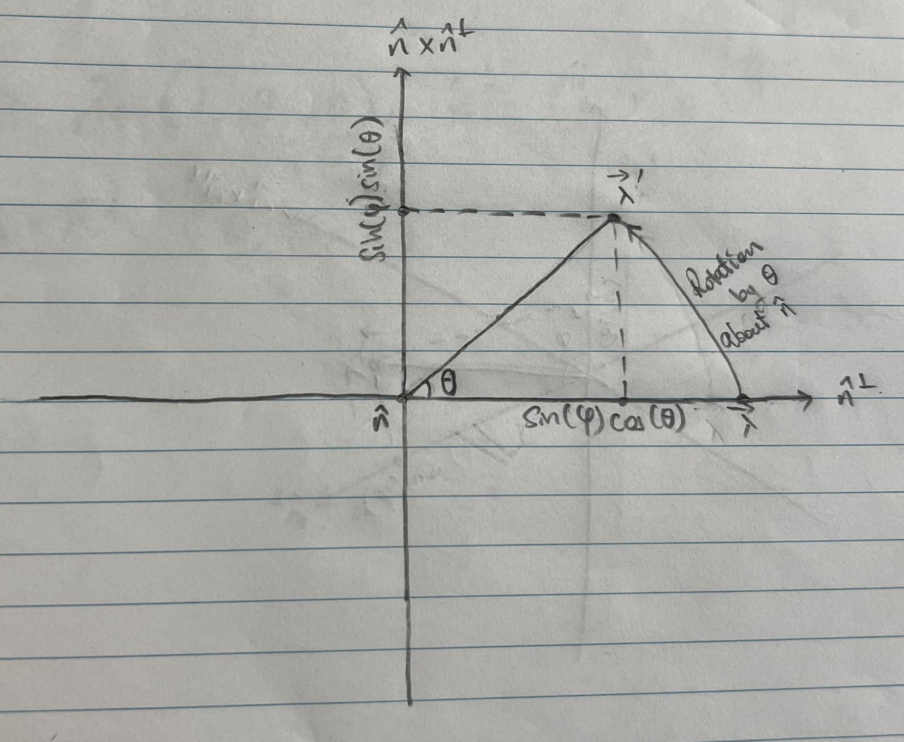

## 4.06
The following is more an explanation than a proof and is adapted from the hints posted in this forum:\
https://quantumcomputing.stackexchange.com/questions/17026/exercise-4-6-in-quantum-computing-and-quantum-information-nielsen-and-chuang

The premise of the author's argument is that, given $`\vec{\lambda}`$ and a three dimensional unit vector $`\vec{n}`$ corresponding to the axis $`\hat{n}`$, we can write 

```math
\vec{\lambda} = a\vec{n} + b\vec{n}^\perp
```
where $`\vec{n}`$ and $`\vec{n}^\perp`$ are orthogonal. The proof of this is simple: extend $`\vec{n}`$ to an orthonormal basis $`\{\vec{n}\} \cup \{\vec{i}\}`$; write $`\vec{\lambda} = a\vec{n} + \sum_i{b_i \vec{i}}`$; and then set $`b = \sqrt{\sum {b^2_i}}`$ and $`\vec{n}^\perp = \frac{1}{b}\sum_i{b_i \vec{i}}`$. Moreover, since $`\vec{\lambda}`$ is a real unit vector, we have $`a^2 + b^2 = 1 \rightarrow a = \cos(\varphi), b = \sin(\varphi)`$ for appropriate choice of $`\varphi`$.

The density operator corresponding to $`\vec{\lambda}`$ is
```math
\rho =\frac{1}{2}(I+\vec{\lambda}\cdot\vec{\sigma})=\frac{1}{2}(I+\cos(\varphi)\vec{n}\cdot\vec{\sigma} + \sin(\varphi)\vec{n}^\perp\cdot\vec{\sigma})
```
and a rotation by angle $`\theta`$ about $`\hat{n}`$ is given by 
```math
\begin{align*}
R_{\hat{n}}(\theta)\rho R_{\hat{n}}(-\theta) 
&=\frac{1}{2}(I+\cos(\varphi)R_{\hat{n}}(\theta)\vec{n}\cdot\vec{\sigma}R_{\hat{n}}(-\theta) + \sin(\varphi)R_{\hat{n}}(\theta)\vec{n}^\perp\cdot\vec{\sigma}R_{\hat{n}}(-\theta))\\

&=\frac{1}{2}(I+\cos(\varphi)\vec{n}\cdot\vec{\sigma} + \sin(\varphi)R_{\hat{n}}(\theta)\vec{n}^\perp\cdot\vec{\sigma}R_{\hat{n}}(-\theta))\\

&=\frac{1}{2}(I+\cos(\varphi)\vec{n}\cdot\vec{\sigma} + \sin(\varphi)(\cos(\theta)\vec{n}^\perp\cdot\vec{\sigma} + \sin(\theta)(\vec{n}\times\vec{n}^\perp)\cdot\vec{\sigma}))
\end{align*}
```

which is the expected result of the rotation. What follows is an explanation of why.

We can derive a coordinate system from the basis vectors $`\vec{n}, \vec{n}^\perp`$ and $` \vec{n} \times \vec{n}^\perp`$, in which the bloch vector $`\vec{\lambda}`$ lies along the $`\hat{n}- \hat{n}^\perp`$ plane (i.e. its $`\hat{n},\hat{n}^\perp,(\hat{n} \times \hat{n}^\perp)`$ coordinates are $`(\cos(\varphi), \sin(\varphi), 0)`$)\


A $`\theta`$ rotation about the $`\hat{n}`$ axis is best observed by looking along the $`\hat{n}`$ axis, as if the axis points out of the page and directly towards us, as illustrated below. Initially, the projection of $`\vec{\lambda}`$ in the two dimensional plane lies along $`\hat{n}^\perp`$ and its length, which is constant with rotations about $`\hat{n}`$, is $`\sin(\varphi)`$. It follows that the rotated coordinates of the vector's projection is simply its projected length multiplied by cosine or sine of the rotation angle.



The outcome of the rotation in three dimensions can be observed below.\
