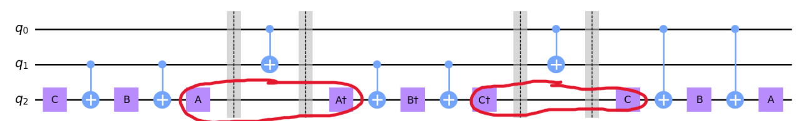
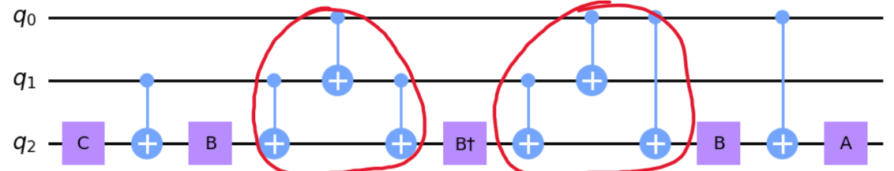
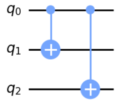
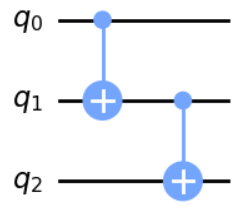
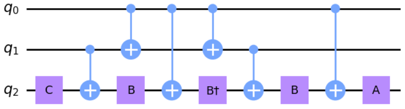

## 4.22

Note that the phase operator has been omitted from all illustrations for simplicity, however they will be included in the total gate count.

Putting figure 4.6 and 4.8 from the textbook together, we arrive at the unsimplified circuit shown above. Including phase gates, there are 12 single qubit gates and 8 $`CNOT`$ gates. The first and most obvious simplification we can make is to cancel out adjacent inverse unitaries circled in red, which lowers the single qubit gate count to 8 as required.

The final step is to simplify the two $`CNOT`$ triplets circled in red above. We see that the truth table of the first is given by:

| q0 | q1 | q2 | q0' | q1' | q2' |
|----|----|----|-----|-----|-----|
| 0 | 0 | 0 | 0 | 0 | 0 |
| 0 | 0 | 1 | 0 | 0 | 1 |
| 0 | 1 | 0 | 0 | 1 | 0 |
| 0 | 1 | 1 | 0 | 1 | 1 |
| 1 | 0 | 0 | 1 | 1 | 1 |
| 1 | 0 | 1 | 1 | 1 | 0 |
| 1 | 1 | 0 | 1 | 0 | 1 |
| 1 | 1 | 1 | 1 | 0 | 0 |

which is equal to the circuit

and the second is given by:

| q0 | q1 | q2 | q0' | q1' | q2' |
|----|----|----|-----|-----|-----|
| 0 | 0 | 0 | 0 | 0 | 0 |
| 0 | 0 | 1 | 0 | 0 | 1 |
| 0 | 1 | 0 | 0 | 1 | 1 |
| 0 | 1 | 1 | 0 | 1 | 0 |
| 1 | 0 | 0 | 1 | 1 | 1 |
| 1 | 0 | 1 | 1 | 1 | 0 |
| 1 | 1 | 0 | 1 | 0 | 0 |
| 1 | 1 | 1 | 1 | 0 | 1 |

which is equal to the circuit

The final circuit is depicted below. Note that there are 8 single qubit gates and 6 $`CNOT`$ gates as required.

