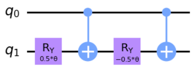
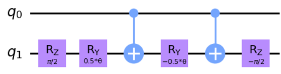

## 4.23

$`C^1(R_Y(\theta))`$ is simple to construct using two single qubit gates. Since we know $`XR_Y(\theta)X =R_Y(\theta)`$ we have:

$`R_X(\theta)`$ can be written $`R_Z(\pi/2)R_Y(\theta)R_Z(\pi/2)`$ and therefore, the three single qubit gate implementation of $`C^1(R_X)`$ is:

From lemma 5.4 of [Barenco et al.](https://arxiv.org/pdf/quant-ph/9503016.pdf), $`C^1(U)`$ can be constructed using two single qubit gates in the same fashion as illustrated for $`C^1(R_Y(\theta))`$ if and only if we can write $`U=R_Z(\alpha)R_Y(\beta)R_Z(\alpha)`$. Since $`R_X(\theta)`$ does not take this form, a two single qubit gate simplification is impossible.