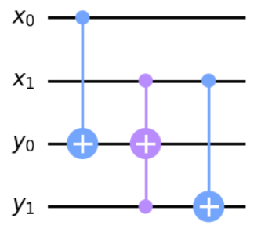
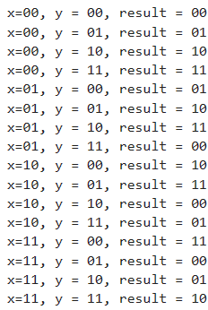

## 4.36
In the image below the most significant digit of x and y are labelled by the zero subscript ($`x_0=1, x_1=0\rightarrow x=2`$). This is counter to qiskit convention so in the proof of concept, I've had to flip the measurement result around.



Proof of concept:
```
def initialise(qc, digits):
    for i in range(len(digits)):
        if digits[i]:
            qc.x(i)

backend = Aer.get_backend('statevector_simulator')
x = QuantumRegister(2, 'x')
y = QuantumRegister(2, 'y')
cl = ClassicalRegister(2)
qc = QuantumCircuit(x, y, cl)

num_bits = 4
for i in range(16):
    digits = [(i >> bit) & 1 for bit in range(num_bits - 1, -1, -1)]
    initialise(qc, digits)
    qc.cnot(x[0], y[0])
    qc.toffoli(x[1], y[1], y[0])
    qc.cnot(x[1], y[1])
    qc.measure(y, cl)
    
    job = backend.run(transpile(qc, backend), shots=1)
    result = job.result()
    print(f"x={digits[0]}{digits[1]}, y = {digits[2]}{digits[3]}, result = {list(result.get_counts().keys())[0][::-1]}")
    qc.reset(x)
    qc.reset(y)
```


