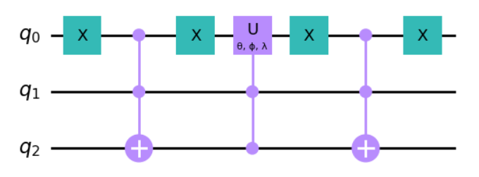

## 4.39

The matrix acts non-trivially on vector components corresponding to vectors $`\ket{010}`$ and $`\ket{111}`$. The Gray code connecting the two binary strings is:

```math
\begin{matrix}
q0&q1&q2\\
0&1&0\\
0&1&1\\
1&1&1
\end{matrix}
```
where, adopting the textbook's notation, $`\ket{g_1}=\ket{010}`$ and $`\ket{g_2}=\ket{011}`$ differ in the last position and can be swapped with one another by controlling the first two bits and flipping the third.


